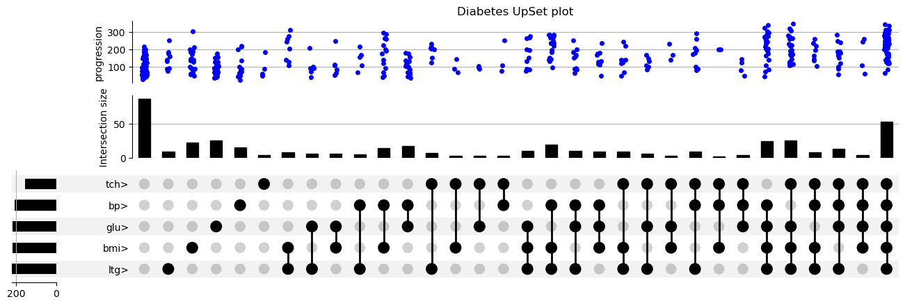

# PEC 2 Estudio de técnicas de visualización de datos

En este repositorio se encuentran las figuras con las 3 técnicas a utilizar:

  - Sankey Diagrams
  - Box plot
  - UpSet: Visualizing Intersecting Sets

## Sankey Diagram of Fernando Alonso's starts in F1

**Source:** https://www.statsf1.com/en/fernando-alonso/engagement.aspx

* Developed with [SankeyMATIC](https://sankeymatic.com/) *
## Box Plot of Sepal & Petal characeristics in the Iris dataset

**Source:** https://archive.ics.uci.edu/ml/datasets/Iris/

## Diabetes over average parameters UpSet visualization 
**Source**: https://www4.stat.ncsu.edu/~boos/var.select/diabetes.html

