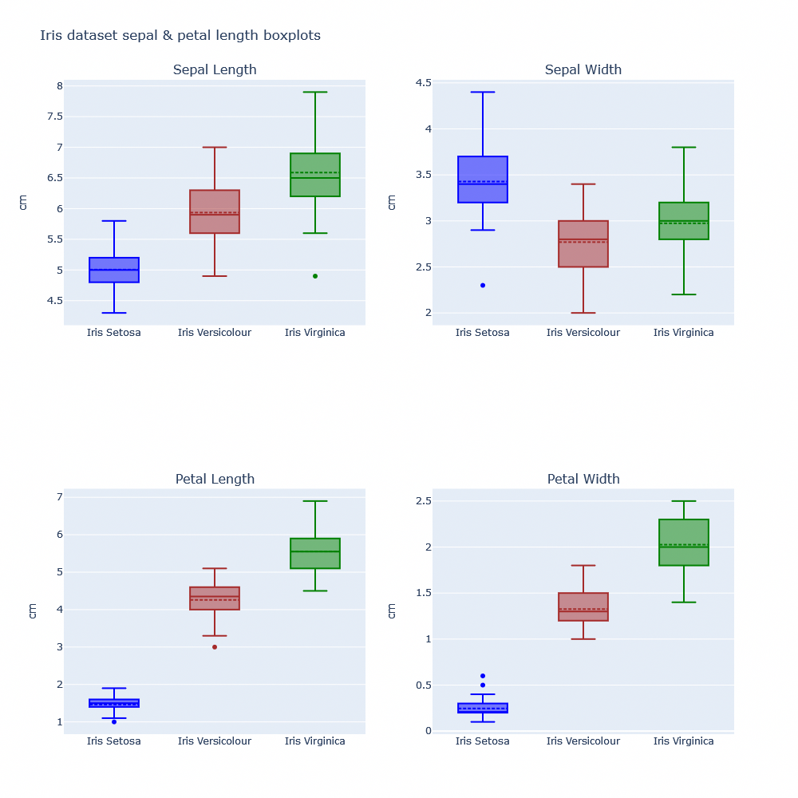

# PEC 2 Estudio de técnicas de visualización de datos

En este repositorio se encuentran las figuras con las 3 técnicas a utilizar:

  - Sankey Diagrams
  - Box plot
  - UpSet: Visualizing Intersecting Sets

## Sankey Diagram of Fernando Alonso's starts in F1

## Box Plot of Sepal & Petal characeristics in the Iris dataset

